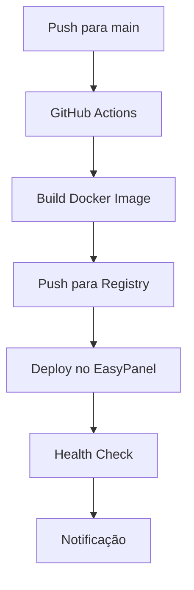

# 🚀 Guia de Deploy - Shinobi CCTV

Este guia fornece instruções detalhadas para fazer deploy do Shinobi CCTV no EasyPanel com integração GitHub.

## 📋 Pré-requisitos

- [ ] Conta no GitHub
- [ ] Conta no EasyPanel
- [ ] Docker Hub ou GitHub Container Registry
- [ ] Domínio personalizado (opcional)

## 🔧 Configuração Inicial

### 1. Preparar o Repositório GitHub

```bash
# Clone ou fork o repositório
git clone https://github.com/your-username/shinobi.git
cd shinobi

# Configure o remote para seu repositório
git remote set-url origin https://github.com/SEU-USUARIO/shinobi.git
```

### 2. Configurar Secrets no GitHub

Vá para **Settings > Secrets and variables > Actions** no seu repositório GitHub e adicione:

| Secret | Descrição | Exemplo |
|--------|-----------|---------|
| `EASYPANEL_API_KEY` | Chave da API do EasyPanel | `ep_xxxxxxxxxxxxx` |
| `EASYPANEL_SERVER_ID` | ID do servidor no EasyPanel | `server_123456` |
| `EASYPANEL_PROJECT_NAME` | Nome do projeto | `shinobi` |

### 3. Configurar Container Registry

#### Opção A: GitHub Container Registry (Recomendado)

1. Vá para **Settings > Developer settings > Personal access tokens**
2. Crie um token com permissões: `write:packages`, `read:packages`
3. O GitHub Actions usará automaticamente o `GITHUB_TOKEN`

#### Opção B: Docker Hub

Adicione nos secrets do GitHub:
- `DOCKER_USERNAME`: Seu usuário do Docker Hub
- `DOCKER_PASSWORD`: Sua senha ou token do Docker Hub

## 🌐 Configuração no EasyPanel

### 1. Criar Projeto

1. **Login no EasyPanel**
2. **Criar novo projeto**:
   - Nome: `shinobi`
   - Tipo: `Docker Compose`

### 2. Configurar Variáveis de Ambiente

No painel do EasyPanel, adicione as seguintes variáveis:

```env
NODE_ENV=production
DB_PASSWORD=sua_senha_segura_aqui
DB_ROOT_PASSWORD=senha_root_segura
SUBSCRIPTION_ID=sub_XXXXXXXXXXXX
PLUGIN_KEYS={}
SSL_ENABLED=false
```

### 3. Configurar Domínio (Opcional)

1. **Adicionar domínio personalizado**
2. **Configurar SSL automático**
3. **Configurar redirecionamento HTTPS**

## 🔄 Deploy Automático

### 1. Configurar Webhook (Opcional)

Para deploy automático mais rápido:

```bash
# No EasyPanel, vá para Project Settings > Webhooks
# Adicione a URL do webhook nos secrets do GitHub
```

### 2. Fluxo de Deploy



### 3. Comandos de Deploy

```bash
# Deploy manual via script
chmod +x scripts/deploy-easypanel.sh
./scripts/deploy-easypanel.sh deploy latest

# Deploy de uma tag específica
./scripts/deploy-easypanel.sh deploy v1.0.0

# Verificar status
./scripts/deploy-easypanel.sh status
```

## 🛠️ Deploy Manual

### 1. Build Local

```bash
# Build da imagem
docker build -f Dockerfile.prod -t shinobi:latest .

# Tag para registry
docker tag shinobi:latest ghcr.io/seu-usuario/shinobi:latest

# Push para registry
docker push ghcr.io/seu-usuario/shinobi:latest
```

### 2. Deploy via EasyPanel CLI

```bash
# Instalar EasyPanel CLI
curl -sSL https://get.easypanel.io | sh

# Login
easypanel auth login

# Deploy
easypanel deploy --project shinobi --image ghcr.io/seu-usuario/shinobi:latest
```

## 📊 Monitoramento Pós-Deploy

### 1. Verificações Essenciais

```bash
# Verificar se os containers estão rodando
docker ps

# Verificar logs
docker logs shinobi-app
docker logs shinobi-db

# Testar conectividade
curl -f http://seu-dominio.com/health
```

### 2. Configurar Monitoramento

1. **Health Checks**: Configurados automaticamente
2. **Alertas**: Configure no painel do EasyPanel
3. **Backup**: Configure backup automático dos volumes

### 3. Métricas Importantes

- **Uptime**: > 99.9%
- **Response Time**: < 2s
- **Memory Usage**: < 80%
- **CPU Usage**: < 70%

## 🔒 Configurações de Segurança

### 1. Banco de Dados

```bash
# Use senhas fortes
DB_PASSWORD=$(openssl rand -base64 32)
DB_ROOT_PASSWORD=$(openssl rand -base64 32)
```

### 2. SSL/HTTPS

```bash
# Habilitar SSL no EasyPanel
SSL_ENABLED=true
```

### 3. Firewall

Configure no EasyPanel:
- Porta 8080: Apenas HTTPS
- Porta 3306: Apenas containers internos

## 🔧 Troubleshooting

### Problemas Comuns

#### 1. Container não inicia

```bash
# Verificar logs
docker logs shinobi-app

# Verificar variáveis de ambiente
docker exec shinobi-app env | grep DB_
```

#### 2. Banco de dados não conecta

```bash
# Testar conexão
docker exec shinobi-app nc -zv db 3306

# Verificar logs do banco
docker logs shinobi-db
```

#### 3. Deploy falha

```bash
# Verificar GitHub Actions
# Ir para Actions tab no GitHub

# Verificar imagem no registry
docker pull ghcr.io/seu-usuario/shinobi:latest
```

### Comandos de Debug

```bash
# Entrar no container
docker exec -it shinobi-app bash

# Verificar arquivos de configuração
docker exec shinobi-app cat /home/Shinobi/conf.json

# Reiniciar serviços
docker-compose restart shinobi
```

## 🔄 Rollback

### 1. Rollback Automático

```bash
# Via script
./scripts/deploy-easypanel.sh rollback v1.0.0
```

### 2. Rollback Manual

```bash
# No EasyPanel, vá para Deployments
# Selecione uma versão anterior
# Clique em "Rollback"
```

## 📈 Otimizações

### 1. Performance

```yaml
# docker-compose.prod.yml
deploy:
  resources:
    limits:
      memory: 2G
      cpus: '1.0'
    reservations:
      memory: 512M
      cpus: '0.5'
```

### 2. Backup

```bash
# Configurar backup automático
# No EasyPanel: Project > Backups > Schedule
```

### 3. CDN (Opcional)

Configure CDN para assets estáticos:
- Cloudflare
- AWS CloudFront
- DigitalOcean Spaces

## 📞 Suporte

### Logs Importantes

```bash
# Logs da aplicação
docker logs shinobi-app

# Logs do banco
docker logs shinobi-db

# Logs do EasyPanel
# Acesse via dashboard
```

### Contatos

- **GitHub Issues**: Para bugs e features
- **EasyPanel Support**: Para problemas de infraestrutura
- **Email**: support@seu-dominio.com

---

## ✅ Checklist de Deploy

- [ ] Repositório configurado no GitHub
- [ ] Secrets configurados no GitHub
- [ ] Projeto criado no EasyPanel
- [ ] Variáveis de ambiente configuradas
- [ ] Domínio configurado (opcional)
- [ ] SSL habilitado
- [ ] Deploy automático funcionando
- [ ] Health checks passando
- [ ] Backup configurado
- [ ] Monitoramento ativo

**🎉 Parabéns! Seu Shinobi CCTV está pronto para produção!**