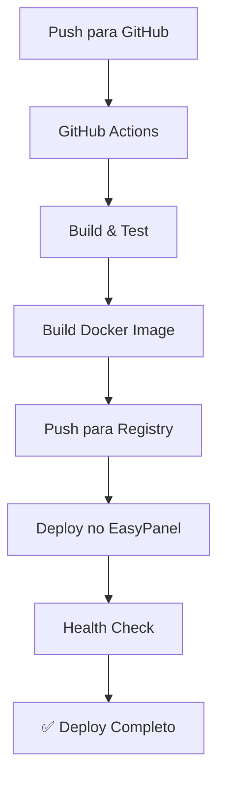

# 🔧 Configuração do GitHub para Deploy Automático

## 📋 Pré-requisitos

- [ ] Conta no GitHub
- [ ] Conta no EasyPanel
- [ ] Repositório criado no GitHub

## 🚀 Passo a Passo

### 1. Criar Repositório no GitHub

1. Vá para https://github.com/new
2. Nome do repositório: `shinobi` (ou o nome que preferir)
3. Deixe público ou privado conforme sua preferência
4. **NÃO** inicialize com README (já temos um)
5. Clique em "Create repository"

### 2. Configurar Remote Local

```bash
# No seu terminal, dentro da pasta do projeto:
git init
git add .
git commit -m "Initial commit: Shinobi CCTV with Docker and EasyPanel support"
git branch -M main
git remote add origin https://github.com/SEU-USUARIO/shinobi.git
git push -u origin main
```

### 3. Configurar Secrets no GitHub

Vá para **Settings > Secrets and variables > Actions** no seu repositório e adicione:

#### Secrets Obrigatórios:

| Nome | Valor | Onde Encontrar |
|------|-------|----------------|
| `EASYPANEL_API_KEY` | Sua chave da API | EasyPanel > Settings > API Keys |
| `EASYPANEL_SERVER_ID` | ID do servidor | EasyPanel > Servers (na URL) |
| `EASYPANEL_PROJECT_NAME` | Nome do projeto | `shinobi` (ou outro nome) |

#### Secrets Opcionais:

| Nome | Valor | Descrição |
|------|-------|-----------|
| `DB_PASSWORD` | Senha do banco | Senha segura para MySQL |
| `DB_ROOT_PASSWORD` | Senha root | Senha root do MySQL |
| `SUBSCRIPTION_ID` | ID da licença | Se tiver licença Pro |

### 4. Configurar Container Registry

#### Opção A: GitHub Container Registry (Recomendado)

✅ **Já configurado automaticamente!** O GitHub Actions usará o `GITHUB_TOKEN` automaticamente.

#### Opção B: Docker Hub (Alternativa)

Se preferir usar Docker Hub, adicione estes secrets:

| Nome | Valor |
|------|-------|
| `DOCKER_USERNAME` | Seu usuário do Docker Hub |
| `DOCKER_PASSWORD` | Sua senha ou token |

E edite `.github/workflows/ci-cd.yml`:

```yaml
# Substitua esta linha:
registry: ghcr.io
# Por esta:
registry: docker.io
```

### 5. Configurar EasyPanel

1. **Login no EasyPanel**
2. **Criar novo projeto**:
   - Nome: `shinobi`
   - Tipo: `Docker`
   - Imagem: `ghcr.io/SEU-USUARIO/shinobi:latest`

3. **Configurar variáveis de ambiente**:
   ```env
   NODE_ENV=production
   DB_HOST=shinobi-db
   DB_USER=shinobi
   DB_PASSWORD=sua_senha_aqui
   DB_DATABASE=shinobi
   DB_ROOT_PASSWORD=senha_root_aqui
   ```

4. **Configurar banco de dados**:
   - Adicionar serviço MariaDB
   - Nome: `shinobi-db`
   - Versão: `10.11`
   - Usar as mesmas variáveis de ambiente

### 6. Testar Deploy

```bash
# Fazer uma alteração e push
echo "# Deploy Test" >> README.md
git add .
git commit -m "Test automatic deployment"
git push origin main
```

Vá para **Actions** no GitHub para acompanhar o deploy.

## 🔄 Fluxo de Deploy



## 📊 Monitoramento

### GitHub Actions
- **Actions Tab**: Ver status dos deploys
- **Logs**: Debugar problemas
- **Artifacts**: Downloads de builds

### EasyPanel
- **Dashboard**: Status dos containers
- **Logs**: Logs da aplicação
- **Metrics**: CPU, Memória, Rede

## 🛠️ Comandos Úteis

```bash
# Ver status do último deploy
gh run list --limit 1

# Ver logs do último deploy
gh run view --log

# Fazer deploy manual de uma tag
git tag v1.0.0
git push origin v1.0.0

# Rollback via EasyPanel
# Use o dashboard para selecionar versão anterior
```

## 🔧 Troubleshooting

### Deploy falha no GitHub Actions

1. **Verificar secrets**: Todos os secrets estão configurados?
2. **Verificar logs**: Ir para Actions > Ver logs detalhados
3. **Verificar permissões**: O token tem permissão para packages?

### Deploy falha no EasyPanel

1. **Verificar API Key**: Está correta e ativa?
2. **Verificar Server ID**: ID do servidor está correto?
3. **Verificar projeto**: Projeto existe no EasyPanel?

### Aplicação não inicia

1. **Verificar variáveis**: Todas as env vars estão configuradas?
2. **Verificar banco**: Banco de dados está rodando?
3. **Verificar logs**: Ver logs no EasyPanel

## 📞 Suporte

- **GitHub Issues**: Para problemas com o código
- **EasyPanel Support**: Para problemas de infraestrutura
- **Documentação**: [README.md](README.md) e [DEPLOY.md](DEPLOY.md)

---

## ✅ Checklist Final

- [ ] Repositório criado no GitHub
- [ ] Código enviado para o GitHub
- [ ] Secrets configurados no GitHub
- [ ] Projeto criado no EasyPanel
- [ ] Variáveis configuradas no EasyPanel
- [ ] Deploy automático funcionando
- [ ] Aplicação acessível
- [ ] Monitoramento ativo

**🎉 Parabéns! Seu Shinobi CCTV está pronto para produção com deploy automático!**