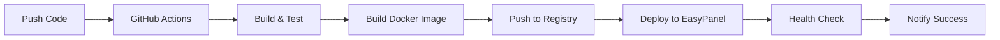

# Shinobi CCTV - Sistema de Videovigilância


Sistema de CCTV e NVR (Network Video Recorder) de código aberto construído em Node.js, pronto para deploy em Docker e EasyPanel.

## 🚀 Características

- **Interface Web Moderna**: Dashboard responsivo para monitoramento
- **Suporte Multi-Câmeras**: ONVIF, RTMP, HTTP, WebRTC
- **Detecção de Movimento**: IA integrada para análise de vídeo
- **Gravação Inteligente**: Armazenamento local e em nuvem (S3, Google Drive)
- **Notificações**: Email, Discord, Telegram, Push notifications
- **API REST**: Integração com sistemas externos
- **Multi-usuário**: Sistema de permissões e grupos

## 📋 Pré-requisitos

- Docker e Docker Compose
- Node.js 18+ (para desenvolvimento local)
- FFmpeg (incluído no Docker)
- Banco de dados MySQL/MariaDB

## 🐳 Deploy com Docker

### 1. Configuração Rápida

```bash
# Clone o repositório
git clone https://github.com/your-username/shinobi.git
cd shinobi

# Copie e configure as variáveis de ambiente
cp .env.example .env
# Edite o arquivo .env com suas configurações

# Inicie os serviços
docker-compose up -d
```

### 2. Configuração de Produção

```bash
# Para produção, use o compose específico
docker-compose -f docker-compose.prod.yml up -d
```

### 3. Acesso à Aplicação

- **Interface Web**: http://localhost:8080
- **Usuário padrão**: admin@shinobi.video
- **Senha padrão**: admin

## 🌐 Deploy no EasyPanel

### 1. Configuração Inicial

1. **Configure as variáveis de ambiente no EasyPanel:**
   ```bash
   # Copie as configurações
   cp .easypanel.env .easypanel.env.local
   # Edite com suas credenciais do EasyPanel
   ```

2. **Configure os secrets no GitHub:**
   - `EASYPANEL_API_KEY`: Sua chave da API do EasyPanel
   - `EASYPANEL_SERVER_ID`: ID do seu servidor
   - `EASYPANEL_PROJECT_NAME`: Nome do projeto (ex: shinobi)

### 2. Deploy Automático

O deploy é automático via GitHub Actions:

- **Push para `main`**: Deploy em produção
- **Push para `develop`**: Deploy em staging
- **Tags `v*`**: Release com versionamento

### 3. Deploy Manual

```bash
# Usando o script de deploy
chmod +x scripts/deploy-easypanel.sh
./scripts/deploy-easypanel.sh deploy latest

# Verificar status
./scripts/deploy-easypanel.sh status

# Rollback se necessário
./scripts/deploy-easypanel.sh rollback previous
```

## 🔧 Configuração

### Variáveis de Ambiente Principais

| Variável | Descrição | Padrão |
|----------|-----------|--------|
| `NODE_ENV` | Ambiente de execução | `production` |
| `SHINOBI_PORT` | Porta da aplicação | `8080` |
| `DB_HOST` | Host do banco de dados | `db` |
| `DB_USER` | Usuário do banco | `shinobi` |
| `DB_PASSWORD` | Senha do banco | - |
| `DB_DATABASE` | Nome do banco | `shinobi` |
| `SUBSCRIPTION_ID` | ID da licença | - |
| `SSL_ENABLED` | Habilitar HTTPS | `false` |

### Configuração de Câmeras

1. Acesse a interface web
2. Vá para **Configurações > Monitores**
3. Adicione uma nova câmera com:
   - **Nome**: Nome identificador
   - **URL**: rtmp://ip-da-camera/stream
   - **Tipo**: RTMP, HTTP, ONVIF, etc.

### Armazenamento em Nuvem

Configure no arquivo `.env`:

```bash
# AWS S3
AWS_ACCESS_KEY_ID=your_access_key
AWS_SECRET_ACCESS_KEY=your_secret_key
AWS_REGION=us-east-1
AWS_BUCKET_NAME=shinobi-videos

# Google Drive
GOOGLE_DRIVE_CLIENT_ID=your_client_id
GOOGLE_DRIVE_CLIENT_SECRET=your_client_secret
```

## 🔄 CI/CD Pipeline

### GitHub Actions

O projeto inclui pipelines automatizados:

1. **CI (Integração Contínua)**:
   - Testes automatizados
   - Build da imagem Docker
   - Scan de segurança

2. **CD (Deploy Contínuo)**:
   - Deploy automático no EasyPanel
   - Versionamento de releases
   - Rollback automático em falhas

### Fluxo de Trabalho



## 📊 Monitoramento

### Health Checks

- **Aplicação**: `GET /health`
- **Banco de dados**: Verificação de conexão
- **Docker**: Health check integrado

### Logs

```bash
# Ver logs da aplicação
docker-compose logs -f shinobi

# Ver logs do banco
docker-compose logs -f db

# Logs no EasyPanel
# Acesse via dashboard do EasyPanel
```

### Métricas

- **CPU e Memória**: Monitoramento via Docker
- **Uptime**: Health checks automáticos
- **Alertas**: Configuráveis via EasyPanel

## 🛠️ Desenvolvimento

### Setup Local

```bash
# Clone e instale dependências
git clone https://github.com/your-username/shinobi.git
cd shinobi
npm install

# Configure ambiente de desenvolvimento
cp .env.development .env

# Inicie banco de dados
docker-compose up -d db

# Inicie aplicação
npm start
```

### Estrutura do Projeto

```
shinobi/
├── camera.js              # Ponto de entrada principal
├── libs/                  # Bibliotecas principais
│   ├── config.js         # Configurações
│   ├── sql.js            # Banco de dados
│   └── webServer.js      # Servidor web
├── web/                  # Interface web
├── Docker/               # Configurações Docker
├── .github/workflows/    # GitHub Actions
├── scripts/              # Scripts de deploy
└── docs/                 # Documentação
```

### Comandos Úteis

```bash
# Build da imagem Docker
docker build -f Dockerfile.prod -t shinobi:latest .

# Executar testes
npm test

# Linter
npm run lint

# Deploy manual
./scripts/deploy-easypanel.sh deploy latest
```

## 🔒 Segurança

### Configurações Recomendadas

1. **Senhas Fortes**: Use senhas complexas para banco de dados
2. **HTTPS**: Habilite SSL em produção
3. **Firewall**: Restrinja acesso às portas necessárias
4. **Backup**: Configure backups automáticos
5. **Updates**: Mantenha o sistema atualizado

### Variáveis Sensíveis

Nunca commite no Git:
- Senhas de banco de dados
- Chaves de API
- Certificados SSL
- Tokens de acesso

Use sempre arquivos `.env` locais ou secrets do GitHub.

## 📚 Documentação Adicional

- [Configuração de Câmeras](docs/cameras.md)
- [API Reference](docs/api.md)
- [Troubleshooting](docs/troubleshooting.md)
- [Backup e Restore](docs/backup.md)

## 🤝 Contribuição

1. Fork o projeto
2. Crie uma branch para sua feature (`git checkout -b feature/nova-feature`)
3. Commit suas mudanças (`git commit -am 'Adiciona nova feature'`)
4. Push para a branch (`git push origin feature/nova-feature`)
5. Abra um Pull Request

## 📄 Licença

Este projeto está licenciado sob a GPL v3 - veja o arquivo [LICENSE](LICENSE) para detalhes.

## 🆘 Suporte

- **Issues**: [GitHub Issues](https://github.com/your-username/shinobi/issues)
- **Discussões**: [GitHub Discussions](https://github.com/your-username/shinobi/discussions)
- **Email**: support@your-domain.com

## 🙏 Agradecimentos

- [Shinobi Systems](https://shinobi.video) - Projeto original
- [EasyPanel](https://easypanel.io) - Plataforma de deploy
- Comunidade open source

---

**⭐ Se este projeto foi útil, considere dar uma estrela no GitHub!**